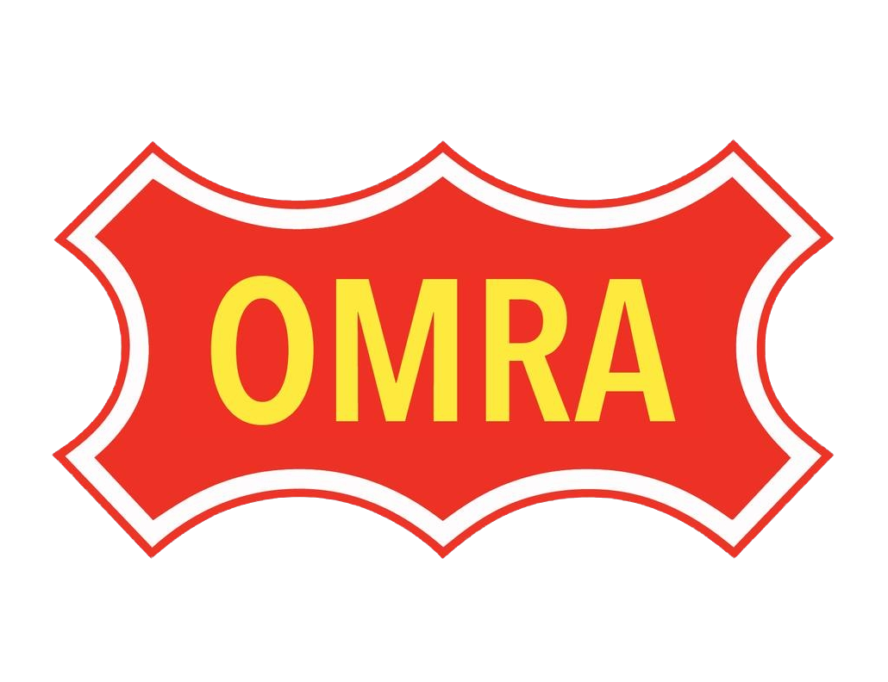

<!-- PROJECT SHIELDS -->

[![Contributors][contributors-shield]][contributors-url]
[![Forks][forks-shield]][forks-url]
[![Stargazers][stars-shield]][stars-url]
[![Issues][issues-shield]][issues-url]

<!-- PROJECT LOGO -->
 

  

  <h3 align="center">OMRA LocoNet DCC Dual 5A Booster</h3>

  

    This Is The Source Files For The OMRA Club DCC Booster Project
     
    ·
    <a href="https://github.com/TheOneTheProdigy/OMRA-LocoNet-DCC-Booster/issues/new?labels=bug&template=bug-report---.md">Report Bug</a>
    ·
    <a href="https://github.com/TheOneTheProdigy/OMRA-LocoNet-DCC-Booster/issues/new?labels=enhancement&template=feature-request---.md">Request Feature</a>
  

<!-- TABLE OF CONTENTS -->

  
Table of Contents

  <ol>
    <li>
      <a href="#about-the-project">About The Project</a>
    </li>
    <li>
      <a href="#getting-started">Getting Started</a>
      <ul>
        <li><a href="#prerequisites">Prerequisites</a></li>
        <li><a href="#installation">Installation</a></li>
      </ul>
    </li>
    <li><a href="#usage">Usage</a></li>
    <li><a href="#roadmap">Roadmap</a></li>
    <li><a href="#contributing">Contributing</a></li>
    <li><a href="#license">License</a></li>
    <li><a href="#contact">Contact</a></li>
    <li><a href="#acknowledgments">Acknowledgments</a></li>
  </ol>

<!-- ABOUT THE PROJECT -->
## About The Project

[![Main About This Project][display]](https://github.com/TheOneTheProdigy/OMRA-LocoNet-DCC-Booster)

We built this booster to help solve a few issues with our club layout. We needed more power districts and more circuit breakers. We decided to build a combo unit that would satisfy both needs. These units can output 5A continuous per output and have 2 track outputs each for a total of 10 amps of dcc power per unit.

Features:
- LocoNet and Railsync
- Dual Circuit Breakers
- Dual 5A Power Districts
- OLED Display With Status and Current Readings
- Auto Track Power
- Opto Isolated Input
- Dual Alarm Outputs

[![Circuit Board][circuit-board]](https://github.com/TheOneTheProdigy/OMRA-LocoNet-DCC-Booster)

(<a href="#readme-top">back to top</a>)

<!-- GETTING STARTED -->
## Getting Started

Have a look in the [PCB Manufacturing Folder](https://github.com/TheOneTheProdigy/OMRA-LocoNet-DCC-Booster/tree/Main-2.0/PCB)

There you will find the EasyEDA CAD files, schematics, gerber files, and all the board design files. You will need to find a manufacture like JLCPCB and print few boards.

Also take a look at the BOM for the list of components you will need to complete the project.

[![IBT2][ibt2]](https://github.com/TheOneTheProdigy/OMRA-LocoNet-DCC-Booster)

*** The 2 slew rate resistors need bridged over (0 Ohm) and the current sense resistors removed on the IBT2! ***

*** If you have V1 of the PCB R17 has been removed, R5 and R20 have been changed to 22K! ***

*** Adjust SMPS to 14.65V RMS and PCB 5V to 5.02V ***

### Prerequisites

[![Screen Shot][screen-shot]](https://github.com/TheOneTheProdigy/OMRA-LocoNet-DCC-Booster)

- A PCB
- Full BOM
- IBT2 Ribbon Cables X2
- 10A 15V SMPS Power Supply
- Some Wire
- LocoNet Command Station
- LocoNet Cable
- USB Type C Cable
- Computer With Arduino IDE
- PCB Stands, Mounting Hardware

### Installation

To begin, you'll need to install the Arduino IDE. Then point the Arduino IDE board manager to a custom URL. Open up Arduino, then go to the Preferences (File > Preferences). Then, towards the bottom of the window, paste this URL into the "Additional Board Manager URLs" text box:

https://raw.githubusercontent.com/sparkfun/Arduino_Boards/main/IDE_Board_Manager/package_sparkfun_index.json

Click OK. Then open the Board Manager by clicking Tools, then hovering over the Board selection tab and clicking Board Manager.

Search for 'sparkfun' in the Board Manager. You should see the SparkFun AVR Boards package appear. Click install, wait a few moments, and all the .brd files you'll need should be installed, indicated by the blue 'Installed' that is printed next to the package.

You should now be able to upload code to the Pro Micro.

Now you will need the libraries installed into the library manager. Copy the zip files from this link and install them in the library manager.

[Library Zip Files For Installation In Arduino IDE](https://github.com/TheOneTheProdigy/OMRA-LocoNet-DCC-Booster/tree/Main-2.0/Firmware/Arduino%20Lib)

Now copy this repository and open it in the Arduino IDE, select the board and COM port and you should be ready to edit and upload.

(<a href="#readme-top">back to top</a>)

<!-- USAGE EXAMPLES -->
## Usage

On first power up you may need to enable debugging to fine tune the analog inputs. The out of the box config works well but may be off .25 to .50 of an AMP due to manufacturing processes of the BTS7960 chips. The debugging flag will output all info to serial port with 9600 baud. Use this info to fine tune if you wish. The 2 offsets allow you to adjust the starting current offset and the 5A current offset. This will in turn change the S curve for all other measurements. You will want to shoot for 0 on no current load and a analog reading of about 520 on a 4.5A load. I use a 2.8 Ohm 10W resistor to test. 

(<a href="#readme-top">back to top</a>)

<!-- ROADMAP -->
## Roadmap

- [] Add LocoNet Features

See the [open issues](https://github.com/TheOneTheProdigy/OMRA-LocoNet-DCC-Booster/issues) for a full list of proposed features (and known issues).

(<a href="#readme-top">back to top</a>)

<!-- CONTRIBUTING -->
## Contributing

Contributions are what make the open source community such an amazing place to learn, inspire, and create. Any contributions you make are **greatly appreciated**.

If you have a suggestion that would make this better, please fork the repo and create a pull request. You can also simply open an issue with the tag "enhancement".
Don't forget to give the project a star! Thanks again!

1. Fork the Project
2. Create your Feature Branch (`git checkout -b feature/AmazingFeature`)
3. Commit your Changes (`git commit -m 'Add some AmazingFeature'`)
4. Push to the Branch (`git push origin feature/AmazingFeature`)
5. Open a Pull Request

### Top contributors:

(<a href="#readme-top">back to top</a>)

<!-- LICENSE -->
## License

Distributed under the MIT License. See `LICENSE.txt` for more information.

(<a href="#readme-top">back to top</a>)

<!-- CONTACT -->
## Contact

Project Link: [https://github.com/TheOneTheProdigy/OMRA-LocoNet-DCC-Booster](https://github.com/TheOneTheProdigy/OMRA-LocoNet-DCC-Booster)

(<a href="#readme-top">back to top</a>)

<!-- ACKNOWLEDGMENTS -->
## Acknowledgments

* [OMRA](http://www.omraspringfield.org/)
* [GitHub Pages](https://pages.github.com)

(<a href="#readme-top">back to top</a>)

<!-- MARKDOWN LINKS & IMAGES -->
<!-- https://www.markdownguide.org/basic-syntax/#reference-style-links -->
[contributors-shield]: https://img.shields.io/github/contributors/TheOneTheProdigy/OMRA-LocoNet-DCC-Booster.svg?style=for-the-badge
[contributors-url]: https://github.com/TheOneTheProdigy/OMRA-LocoNet-DCC-Booster/graphs/contributors
[forks-shield]: https://img.shields.io/github/forks/TheOneTheProdigy/OMRA-LocoNet-DCC-Booster.svg?style=for-the-badge
[forks-url]: https://github.com/TheOneTheProdigy/OMRA-LocoNet-DCC-Booster/network/members
[stars-shield]: https://img.shields.io/github/stars/TheOneTheProdigy/OMRA-LocoNet-DCC-Booster.svg?style=for-the-badge
[stars-url]: https://github.com/TheOneTheProdigy/OMRA-LocoNet-DCC-Booster/stargazers
[issues-shield]: https://img.shields.io/github/issues/TheOneTheProdigy/OMRA-LocoNet-DCC-Booster.svg?style=for-the-badge
[issues-url]: https://github.com/TheOneTheProdigy/OMRA-LocoNet-DCC-Booster/issues
[circuit-board]: images/gerber.png
[screen-shot]: images/screenshot.png
[display]: images/display.png
[ibt2]: images/ibt2.png
